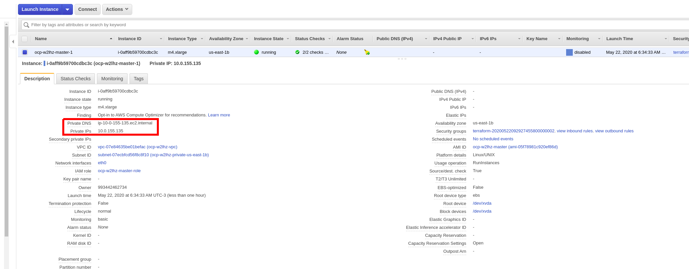
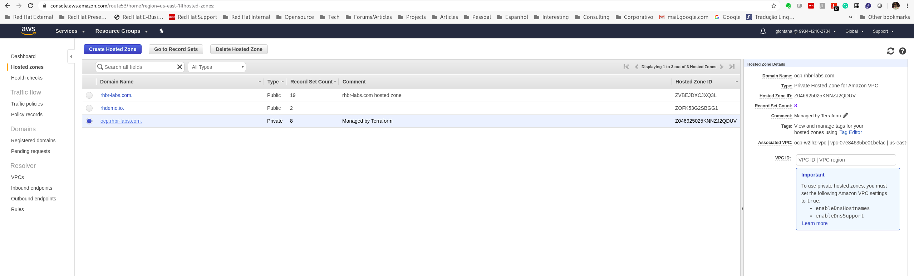
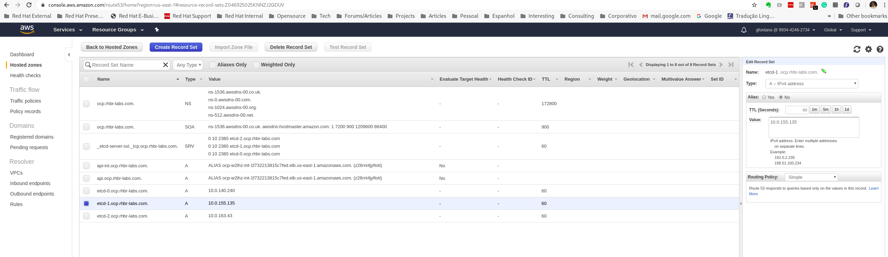

= How to Replace All Masters in an OpenShift IPI Cluster

This procedure was created with my friend Rafael Pécora (*link:https://github.com/pecorawal[@pecorawal]*) and it is based on link:https://docs.openshift.com/container-platform/4.3/backup_and_restore/disaster_recovery/scenario-1-infra-recovery.html[OpenShift documentation].

[NOTE]
====
This procedure has been tested on OpenShift 4.3 and it does not apply to version 4.4 and above.
====

In this article I am going to show how to replace all masters servers, in case you need to restore your cluster of masters and etcds.

To do so, you will need to have at least one functional master/etcd server still working or at least you should have a recent backup to recover one of the masters and start the recovery process.

Therefore we should run the following tasks:

. <<ETCD Backup>>: Backup one of the remaining funcional master nodes. In our case this will be the server master-0 (etcd-0).
. <<Restore backup and etcd cluster>>: Restore backup selecting one etcd member only in the cluster (in our case will be the master-0/etcd-0)
. <<Remove 2 masters nodes>>: Remove other 2 masters nodes (master-1/etcd-1 and master-2/etcd-2)
. <<Recreate masters>>: Recreate both machines (master-1 and master-2)
. <<Update DNS and LB records>>
. <<Run etcd tokenize>> on the remaining funcional master node (master-0/etcd-0)
. <<Run etcd-member-recover for new members>> (master-1/etcd-1 and master-2/etcd-2)

Now you already have your cluster of masters entirely functional and recovered. Only to exercise this process a little bit more, we will also replace the first master node (master-0/etcd-0). In order to do that, we will add the following tasks to our procedure:

[start=8]
. <<Remove the etcd member etcd-0>> (master-0/etcd-0)
. <<Remove server master-0>>
. <<Create a new server master-0>> (master-0/etcd-0)
. <<Update DNS and LB records>>
. <<Run etcd tokenize>> on one of remaining funcional master node (now can be either master-1/etcd-1 or master-2/etcd-2)
. <<Run etcd-member-recover for new the member>> (master-0/etcd-0)

== ETCD Backup

The first step we should follow is to have a funcional backup of the cluster etcd. If you lost your entire cluster, you should restore it from an existing etcd backup that you should already have (in this case you already have your backup and you can skip this step). This process is documented in the OpenShift official process.footnote:[https://docs.openshift.com/container-platform/4.3/backup_and_restore/backing-up-etcd.html]

In our case, we elect the *master-0* as the remaining funcional node.

*Procedure:*
----
# SSH to master-0
[root@ocp-bastion install]# ssh -i ~/.ssh/id_rsa core@10.0.140.240
Red Hat Enterprise Linux CoreOS 43.81.202005180953.0
  Part of OpenShift 4.3, RHCOS is a Kubernetes native operating system
  managed by the Machine Config Operator (`clusteroperator/machine-config`).

WARNING: Direct SSH access to machines is not recommended; instead,
make configuration changes via `machineconfig` objects:
  https://docs.openshift.com/container-platform/4.3/architecture/architecture-rhcos.html

---
Last login: Fri May 22 10:32:14 2020 from 172.31.36.49
[core@ip-10-0-140-240 ~]$ sudo -i
[root@ip-10-0-140-240 ~]# /usr/local/bin/etcd-snapshot-backup.sh ./assets/backup
Creating asset directory ./assets
683bef0adcff2cce1214a3cd00b78a06fedf6866f02d020cedc8ca89bcd902d3
etcdctl version: 3.3.17
API version: 3.3
Trying to backup etcd client certs..
etcd client certs found in /etc/kubernetes/static-pod-resources/kube-apiserver-pod-6 backing up to ./assets/backup/
Backing up /etc/kubernetes/manifests/etcd-member.yaml to ./assets/backup/
Trying to backup latest static pod resources..
{"level":"warn","ts":"2020-05-22T10:35:19.130Z","caller":"clientv3/retry_interceptor.go:116","msg":"retry stream intercept"}
Snapshot saved at ./assets/backup/snapshot_2020-05-22_103518.db
snapshot db and kube resources are successfully saved to ./assets/backup!

----

Copy backup to a bastion host:
----
[root@ip-10-0-140-240 ~]# tar -cvzf etcd-20200522-bkp.tgz assets 
assets/
assets/backup/
assets/backup/etcd-ca-bundle.crt
assets/backup/etcd-client.crt
assets/backup/etcd-client.key
... omitted ...
[root@ip-10-0-140-240 ~]# mv etcd-20200522-bkp.tgz /home/core/
[root@ip-10-0-140-240 ~]# chown core:core /home/core/etcd-20200522-bkp.tgz 
[root@ip-10-0-140-240 ~]# exit
logout
[core@ip-10-0-140-240 ~]$ exit
logout
Connection to 10.0.140.240 closed.

[root@ocp-bastion install]# scp -i ~/.ssh/id_rsa core@10.0.140.240:/home/core/etcd-20200522-bkp.tgz .
etcd-20200522-bkp.tgz                                                                                                                   100%   23MB  83.0MB/s   00:00    
                       
----

== Restore backup and etcd cluster

Now we should restore the backup selecting etcd-0 as the only etcd member in the cluster. We should do this to restore the etcd cluster quorum and, as such, restoring access to our OpenShift api and console.

This procedure should be done in our remaining funcional node or the first member selected to be recovered. In our case this is the server master-0/etcd-0.

*Procedure:*
----
# Copy the backup to our remaining funcional node (or the first member selected to be recovered):
[root@ocp-bastion recover-master-2]# scp -i ~/.ssh/id_rsa etcd-20200522-bkp.tgz core@10.0.140.240:/home/core/
etcd-20200522-bkp.tgz                                                                                                                   100%   23MB 118.8MB/s   00:00    

# SSH to master-0 (our remaining funcional node)
[core@ip-10-0-140-240 ~]$ tar -xvzf  etcd-20200522-bkp.tgz
assets/
assets/backup/
assets/backup/etcd-ca-bundle.crt
assets/backup/etcd-client.crt
assets/backup/etcd-client.key
... omitted ...
[core@ip-10-0-140-240 ~]$ export INITIAL_CLUSTER="etcd-member-ip-10-0-140-240.ec2.internal=https://etcd-0.ocp.rhbr-labs.com:2380"
[core@ip-10-0-140-240 ~]$ sudo -E /usr/local/bin/etcd-snapshot-restore.sh /home/core/assets/backup $INITIAL_CLUSTER
e72fde15c357a44bd242d28853e8ad66fba2e0ce472c4602f55b9634c8dadf46
etcdctl version: 3.3.17
API version: 3.3
etcd-member.yaml found in ./assets/backup/
Stopping all static pods..
..stopping etcd-member.yaml
..stopping kube-scheduler-pod.yaml
..stopping kube-controller-manager-pod.yaml
..stopping kube-apiserver-pod.yaml
... omitted ...
Restoring etcd member etcd-member-ip-10-0-140-240.ec2.internal from snapshot..
2020-05-22 10:47:08.134229 I | pkg/netutil: resolving etcd-0.ocp.rhbr-labs.com:2380 to 10.0.140.240:2380
2020-05-22 10:47:09.775887 I | mvcc: restore compact to 25232
2020-05-22 10:47:09.814652 I | etcdserver/membership: added member 890a07c73df999b0 [https://etcd-0.ocp.rhbr-labs.com:2380] to cluster ea5a775da961a326
Starting static pods..
..starting etcd-member.yaml
..starting kube-scheduler-pod.yaml
..starting kube-controller-manager-pod.yaml
..starting kube-apiserver-pod.yaml
Starting kubelet..
----

Some minutes after above procedure you should have your cluster functional again. After that, check if we only have etcd-0 in our etcd cluster:
----
[root@ocp-bastion install]# oc -n openshift-etcd rsh $(oc get pods -n openshift-etcd | grep ip-10-0-140-240 | awk '{print $1}') <1>
Defaulting container name to etcd-member.
Use 'oc describe pod/etcd-member-ip-10-0-140-240.ec2.internal -n openshift-etcd' to see all of the containers in this pod.
sh-4.2# export ETCDCTL_API=3 ETCDCTL_CACERT=/etc/ssl/etcd/ca.crt ETCDCTL_CERT=$(find /etc/ssl/ -name *peer*crt) ETCDCTL_KEY=$(find /etc/ssl/ -name *peer*key)
sh-4.2# etcdctl member list -w table
+------------------+---------+------------------------------------------+---------------------------------------+---------------------------+
|        ID        | STATUS  |                   NAME                   |              PEER ADDRS               |       CLIENT ADDRS        |
+------------------+---------+------------------------------------------+---------------------------------------+---------------------------+
| 890a07c73df999b0 | started | etcd-member-ip-10-0-140-240.ec2.internal | https://etcd-0.ocp.rhbr-labs.com:2380 | https://10.0.140.240:2379 |
+------------------+---------+------------------------------------------+---------------------------------------+---------------------------+
sh-4.2# 
----
<1> Change ip-10-0-140-240 for the ip of your master-0

== Remove 2 masters nodes 

(master-1/etcd-1 and master-2/etcd-2)

Now we should remove problematic master nodes to replace them further. Before deleting them let's export their machine configurations to be used to recreate them.

*Procedure:*
----
# Export master-0
[root@ocp-bastion install]# oc get machine $(oc get machines -n openshift-machine-api -o wide | grep master-0 | awk '{ print $1 }') -n openshift-machine-api -o yaml > new-master-0.yaml
# Export master-1
[root@ocp-bastion install]# oc get machine $(oc get machines -n openshift-machine-api -o wide | grep master-1 | awk '{ print $1 }') -n openshift-machine-api -o yaml > new-master-1.yaml
# Export master-2
[root@ocp-bastion install]# oc get machine $(oc get machines -n openshift-machine-api -o wide | grep master-2 | awk '{ print $1 }') -n openshift-machine-api -o yaml > new-master-2.yaml
----

Now we can remove masters 1 and 2.

*Procedure:*
----
# Remove master-1
[root@ocp-bastion install]# oc delete machine -n openshift-machine-api $(oc get machines -n openshift-machine-api -o wide | grep master-1 | awk '{ print $1 }')
machine.machine.openshift.io "ocp-w2lhz-master-1" deleted
# Remove master-2
[root@ocp-bastion install]# oc delete machine -n openshift-machine-api $(oc get machines -n openshift-machine-api -o wide | grep master-2 | awk '{ print $1 }')
machine.machine.openshift.io "ocp-w2lhz-master-2" deleted
----

At this time, your cluster may become nonfunctional again:
----
[root@ocp-bastion install]# oc get machines -n openshift-machine-api 
The connection to the server api.ocp.rhbr-labs.com:6443 was refused - did you specify the right host or port?
----

If you get this problem you can remove the servers manually on AWS and restore the backup again in the master-0 (step above).
----
[core@ip-10-0-140-240 ~]$ export INITIAL_CLUSTER="etcd-member-ip-10-0-140-240.ec2.internal=https://etcd-0.ocp.rhbr-labs.com:2380"
[core@ip-10-0-140-240 ~]$ sudo -E /usr/local/bin/etcd-snapshot-restore.sh /home/core/assets/backup $INITIAL_CLUSTER                                                      
b3dd01ff7158ee8809b761d97be626d1e42760f2de505fcc4e950a951d213f1b
etcdctl version: 3.3.17
... omitted ...
2020-05-22 11:12:16.784231 I | etcdserver/membership: added member 890a07c73df999b0 [https://etcd-0.ocp.rhbr-labs.com:2380] to cluster ea5a775da961a326
Starting static pods..
..starting etcd-member.yaml
..starting kube-scheduler-pod.yaml
..starting kube-controller-manager-pod.yaml
..starting kube-apiserver-pod.yaml
Starting kubelet..
----

After some minutes that you recovered your backup you will see that the api will become functional again, but still showing master-1 and master-2 (because at the time of your backup both servers still exists). Wait up to 10 minutes and the OpenShift will move those masters to "Failed" state:
----
[root@ocp-bastion install]# oc get machines -n openshift-machine-api 
NAME                                PHASE     TYPE        REGION      ZONE         AGE
ocp-w2lhz-master-0                  Running   m4.xlarge   us-east-1   us-east-1a   94m
ocp-w2lhz-master-1                  Failed    m4.xlarge   us-east-1   us-east-1b   94m
ocp-w2lhz-master-2                  Failed    m4.xlarge   us-east-1   us-east-1c   94m
ocp-w2lhz-worker-us-east-1a-nq6g2   Running   m4.large    us-east-1   us-east-1a   89m
ocp-w2lhz-worker-us-east-1b-chzl6   Running   m4.large    us-east-1   us-east-1b   89m
ocp-w2lhz-worker-us-east-1c-6zdpt   Running   m4.large    us-east-1   us-east-1c   89m
----

Now remove the machines again:
----
[root@ocp-bastion install]# oc delete machine -n openshift-machine-api $(oc get machines -n openshift-machine-api -o wide | grep master-1 | awk '{ print $1 }')
machine.machine.openshift.io "ocp-w2lhz-master-1" deleted
[root@ocp-bastion install]# oc delete machine -n openshift-machine-api $(oc get machines -n openshift-machine-api -o wide | grep master-2 | awk '{ print $1 }')
machine.machine.openshift.io "ocp-w2lhz-master-2" deleted
[root@ocp-bastion install]# oc get machines -n openshift-machine-api
NAME                                PHASE     TYPE        REGION      ZONE         AGE
ocp-w2lhz-master-0                  Running   m4.xlarge   us-east-1   us-east-1a   94m
ocp-w2lhz-worker-us-east-1a-nq6g2   Running   m4.large    us-east-1   us-east-1a   90m
ocp-w2lhz-worker-us-east-1b-chzl6   Running   m4.large    us-east-1   us-east-1b   90m
ocp-w2lhz-worker-us-east-1c-6zdpt   Running   m4.large    us-east-1   us-east-1c   90m
[root@ocp-bastion install]# oc get nodes
NAME                           STATUS   ROLES    AGE   VERSION
ip-10-0-129-242.ec2.internal   Ready    worker   86m   v1.16.2
ip-10-0-140-240.ec2.internal   Ready    master   94m   v1.16.2
ip-10-0-148-0.ec2.internal     Ready    worker   86m   v1.16.2
ip-10-0-161-99.ec2.internal    Ready    worker   86m   v1.16.2
----

== Recreate masters

(master-1 and master-2)

Now we will use the machine config yaml files that you exported before.

*Procedure:*
----
[root@ocp-bastion install]# vi new-master-0.yaml
# Remove entire "status" section
# Remove the providerID field
[root@ocp-bastion install]# vi new-master-1.yaml
# Remove entire "status" section
# Remove the providerID field
[root@ocp-bastion install]# vi new-master-2.yaml
# Remove entire "status" section
# Remove the providerID field

# Now recreate the masters
[root@ocp-bastion install]# oc create -f new-master-1.yaml
machine.machine.openshift.io/ocp-w2lhz-master-1 created
[root@ocp-bastion install]# oc create -f new-master-2.yaml
machine.machine.openshift.io/ocp-w2lhz-master-2 created
[root@ocp-bastion install]# oc get machines -n openshift-machine-api
NAME                                PHASE          TYPE        REGION      ZONE         AGE
ocp-w2lhz-master-0                  Running        m4.xlarge   us-east-1   us-east-1a   96m
ocp-w2lhz-master-1                  Provisioning   m4.xlarge   us-east-1   us-east-1a   13s
ocp-w2lhz-master-2                  Provisioning   m4.xlarge   us-east-1   us-east-1a   8s
ocp-w2lhz-worker-us-east-1a-nq6g2   Running        m4.large    us-east-1   us-east-1a   91m
ocp-w2lhz-worker-us-east-1b-chzl6   Running        m4.large    us-east-1   us-east-1b   91m
ocp-w2lhz-worker-us-east-1c-6zdpt   Running        m4.large    us-east-1   us-east-1c   91m
----

Wait until the new masters (master-1 and master-2) to be in `Running` state:
----
[root@ocp-bastion recover-master-2]# oc get machines -n openshift-machine-api
NAME                                PHASE     TYPE        REGION      ZONE         AGE
ocp-w2lhz-master-0                  Running   m4.xlarge   us-east-1   us-east-1a   118m
ocp-w2lhz-master-1                  Running   m4.xlarge   us-east-1   us-east-1a   22m
ocp-w2lhz-master-2                  Running   m4.xlarge   us-east-1   us-east-1a   22m
ocp-w2lhz-worker-us-east-1a-nq6g2   Running   m4.large    us-east-1   us-east-1a   114m
ocp-w2lhz-worker-us-east-1b-chzl6   Running   m4.large    us-east-1   us-east-1b   114m
ocp-w2lhz-worker-us-east-1c-6zdpt   Running   m4.large    us-east-1   us-east-1c   114m
----

== Update DNS and LB records

Now we already have our 3 masters online again, however we still have only one etcd running on the cluster (on master-0). In the next steps we will deploy etcd on the new masters and add them to the etcd cluster.

The first step we need to update is the DNS and LoadBalancer in the AWS console. 

*Procedure:*

To do so, get the IP address of the new servers in the AWS Console:

.Get Instance IP Address

Now open the HostedZone for OCP in Route53:

.AWS Hosted Zones

Finally update the records etcd-1 and etcd-2 for this cluster:

.AWS Hosted Zones

LoadBalancer is automatically updated if you are running an IPI cluster. If you are using an UPI cluster, you should manually update your LB also.

== Run etcd tokenize

Now we need to start the etcd-signer in the master-0.

*Procedure:*
----
[root@ocp-bastion recover-master-2]# ssh -i ~/.ssh/id_rsa core@10.0.140.240
... omitted ...
Last login: Fri May 22 11:08:03 2020 from 172.31.36.49
[core@ip-10-0-140-240 ~]$ sudo oc login https://api-int.ocp.rhbr-labs.com:6443
The server uses a certificate signed by an unknown authority.
You can bypass the certificate check, but any data you send to the server could be intercepted by others.
Use insecure connections? (y/n): y

Authentication required for https://api-int.ocp.rhbr-labs.com:6443 (openshift)
Username: kubeadmin
Password: 
Login successful.

You have access to 53 projects, the list has been suppressed. You can list all projects with 'oc projects'

Using project "default".
Welcome! See 'oc help' to get started.
[core@ip-10-0-140-240 ~]$ export KUBE_ETCD_SIGNER_SERVER=$(sudo oc adm release info --image-for kube-etcd-signer-server --registry-config=/var/lib/kubelet/config.json)
[core@ip-10-0-140-240 ~]$ sudo -E /usr/local/bin/tokenize-signer.sh ip-10-0-140-240 <1>
[core@ip-10-0-140-240 ~]$ sudo oc create -f ./assets/manifests/kube-etcd-cert-signer.yaml
pod/etcd-signer created
[core@ip-10-0-140-240 ~]$ sudo oc get pods -n openshift-config
NAME          READY   STATUS    RESTARTS   AGE
etcd-signer   1/1     Running   0          15s
----
<1> Hostname of our functional master. In our case it is master-0

== Run etcd-member-recover for new members

// TODO: SPEAK ABOUT THE BUG IN etcd-member-recover.sh SCRIPT

*Procedure:*
----
# Copy etcdctl bin due bug in etcd-member-recover script
[root@ocp-bastion recover-master-2]# tar -xzf etcd-20200522-bkp.tgz
[root@ocp-bastion recover-master-2]# scp -i ~/.ssh/id_rsa assets/bin/etcdctl core@ip-10-0-136-143:~/
etcdctl                                                                                                                                 100%   24MB  55.4MB/s   00:00    

# SSH to master-1
[root@ocp-bastion recover-master-2]# ssh -i ~/.ssh/id_rsa core@ip-10-0-136-143.ec2.internal
... omitted ...
[core@ip-10-0-136-143 ~]$ mkdir -p ~/assets/bin ~/assets/backup ~/assets/tmp
[core@ip-10-0-136-143 ~]$ mv etcdctl ~/assets/bin/

[core@ip-10-0-136-143 ~]$ sudo vi /usr/local/bin/etcd-member-recover.sh
### COMMENT LINE BELOW (dl_etcdctl)
function run {
  init
#  dl_etcdctl <-- THIS LINE
  backup_manifest
  DISCOVERY_DOMAIN=$(grep -oP '(?<=discovery-srv=).*[^"]' $ASSET_DIR/backup/etcd-member.yaml ) || true
  if [ -z "$DISCOVERY_DOMAIN" ]; then
    echo "Discovery domain can not be extracted from $ASSET_DIR/backup/etcd-member.yaml"
    exit 1
  fi

[core@ip-10-0-136-143 ~]$ sudo oc login https://api-int.ocp.rhbr-labs.com:6443
The server uses a certificate signed by an unknown authority.
You can bypass the certificate check, but any data you send to the server could be intercepted by others.
Use insecure connections? (y/n): y

Authentication required for https://api-int.ocp.rhbr-labs.com:6443 (openshift)
Username: kubeadmin
Password: 
Login successful.

You have access to 53 projects, the list has been suppressed. You can list all projects with 'oc projects'

Using project "default".
Welcome! See 'oc help' to get started.

[core@ip-10-0-136-143 ~]$ export SETUP_ETCD_ENVIRONMENT=$(sudo oc adm release info --image-for machine-config-operator --registry-config=/var/lib/kubelet/config.json)
[core@ip-10-0-136-143 ~]$ export KUBE_CLIENT_AGENT=$(sudo oc adm release info --image-for kube-client-agent --registry-config=/var/lib/kubelet/config.json)
[core@ip-10-0-136-143 ~]$ sudo -E /usr/local/bin/etcd-member-recover.sh 10.0.140.240 etcd-member-ip-10-0-136-143.ec2.internal
Backing up /etc/kubernetes/manifests/etcd-member.yaml to ./assets/backup/
Backing up /etc/etcd/etcd.conf to ./assets/backup/
Trying to backup etcd client certs..
etcd client certs found in /etc/kubernetes/static-pod-resources/kube-apiserver-pod-6 backing up to ./assets/backup/
Stopping etcd..
Waiting for etcd-member to stop
... omitted ...
Waiting for generate-certs to stop
Patching etcd-member manifest..
Updating etcd membership..
Removing etcd data_dir /var/lib/etcd..
Member 2517d85f40558b47 added to cluster ea5a775da961a326

ETCD_NAME="etcd-member-ip-10-0-136-143.ec2.internal"
ETCD_INITIAL_CLUSTER="etcd-member-ip-10-0-136-143.ec2.internal=https://etcd-1.ocp.rhbr-labs.com:2380,etcd-member-ip-10-0-140-240.ec2.internal=https://etcd-0.ocp.rhbr-labs.com:2380"
ETCD_INITIAL_ADVERTISE_PEER_URLS="https://etcd-1.ocp.rhbr-labs.com:2380"
ETCD_INITIAL_CLUSTER_STATE="existing"
Starting etcd..

----
<1> IP 10.0.136.116 is the server functional master, where etcd-signer is running. In our case this is the master-0.

Now you have etcd functional in two masters (master-0 and master-1):
----
[core@ip-10-0-136-143 ~]$ sudo oc get pods -o wide -n openshift-etcd
NAME                                       READY   STATUS     RESTARTS   AGE    IP             NODE                           NOMINATED NODE   READINESS GATES
etcd-member-ip-10-0-136-143.ec2.internal   2/2     Running    0          28s    10.0.136.143   ip-10-0-136-143.ec2.internal   <none>           <none>
etcd-member-ip-10-0-137-235.ec2.internal   0/2     Init:1/2   5          38m    10.0.137.235   ip-10-0-137-235.ec2.internal   <none>           <none>
etcd-member-ip-10-0-140-240.ec2.internal   2/2     Running    0          136m   10.0.140.240   ip-10-0-140-240.ec2.internal   <none>           <none>
[core@ip-10-0-136-143 ~]$ sudo oc -n openshift-etcd rsh etcd-member-ip-10-0-136-143.ec2.internal
Defaulting container name to etcd-member.
Use 'oc describe pod/etcd-member-ip-10-0-136-143.ec2.internal -n openshift-etcd' to see all of the containers in this pod.
sh-4.2# export ETCDCTL_API=3 ETCDCTL_CACERT=/etc/ssl/etcd/ca.crt ETCDCTL_CERT=$(find /etc/ssl/ -name *peer*crt) ETCDCTL_KEY=$(find /etc/ssl/ -name *peer*key)
sh-4.2# etcdctl member list -w table
+------------------+---------+------------------------------------------+---------------------------------------+---------------------------+
|        ID        | STATUS  |                   NAME                   |              PEER ADDRS               |       CLIENT ADDRS        |
+------------------+---------+------------------------------------------+---------------------------------------+---------------------------+
| 2517d85f40558b47 | started | etcd-member-ip-10-0-136-143.ec2.internal | https://etcd-1.ocp.rhbr-labs.com:2380 | https://10.0.136.143:2379 |
| 890a07c73df999b0 | started | etcd-member-ip-10-0-140-240.ec2.internal | https://etcd-0.ocp.rhbr-labs.com:2380 | https://10.0.140.240:2379 |
+------------------+---------+------------------------------------------+---------------------------------------+---------------------------+
----

Repeat procedure above to master-2:
----
[root@ocp-bastion recover-master-2]# scp -i ~/.ssh/id_rsa assets/bin/etcdctl core@ip-10-0-137-235.ec2.internal:~/
Warning: Permanently added 'ip-10-0-137-235.ec2.internal,10.0.137.235' (ECDSA) to the list of known hosts.
etcdctl                                                                                                                                 100%   24MB  51.6MB/s   00:00   
[core@ip-10-0-137-235 ~]$ mkdir -p ~/assets/bin ~/assets/backup ~/assets/tmp
[core@ip-10-0-137-235 ~]$ mv etcdctl ~/assets/bin/
[core@ip-10-0-137-235 ~]$ sudo vi /usr/local/bin/etcd-member-recover.sh
[core@ip-10-0-137-235 ~]$ sudo oc login https://api-int.ocp.rhbr-labs.com:6443
... omitted ...
[core@ip-10-0-137-235 ~]$ export SETUP_ETCD_ENVIRONMENT=$(sudo oc adm release info --image-for machine-config-operator --registry-config=/var/lib/kubelet/config.json)
[core@ip-10-0-137-235 ~]$ export KUBE_CLIENT_AGENT=$(sudo oc adm release info --image-for kube-client-agent --registry-config=/var/lib/kubelet/config.json)
[core@ip-10-0-137-235 ~]$ sudo -E /usr/local/bin/etcd-member-recover.sh 10.0.140.240 etcd-member-ip-10-0-137-235.ec2.internal
[core@ip-10-0-137-235 ~]$ sudo -E /usr/local/bin/etcd-member-recover.sh 10.0.140.240 etcd-member-ip-10-0-137-235.ec2.internal
Backing up /etc/kubernetes/manifests/etcd-member.yaml to ./assets/backup/
Backing up /etc/etcd/etcd.conf to ./assets/backup/
Trying to backup etcd client certs..
etcd client certs found in /etc/kubernetes/static-pod-resources/kube-apiserver-pod-6 backing up to ./assets/backup/
Stopping etcd..
... omitted ...
Member f03ec7613f440ab8 added to cluster ea5a775da961a326

ETCD_NAME="etcd-member-ip-10-0-137-235.ec2.internal"
ETCD_INITIAL_CLUSTER="etcd-member-ip-10-0-136-143.ec2.internal=https://etcd-1.ocp.rhbr-labs.com:2380,etcd-member-ip-10-0-140-240.ec2.internal=https://etcd-0.ocp.rhbr-labs.com:2380,etcd-member-ip-10-0-137-235.ec2.internal=https://etcd-2.ocp.rhbr-labs.com:2380"
ETCD_INITIAL_ADVERTISE_PEER_URLS="https://etcd-2.ocp.rhbr-labs.com:2380"
ETCD_INITIAL_CLUSTER_STATE="existing"
Starting etcd..
[core@ip-10-0-137-235 ~]$ sudo oc get pods -o wide -n openshift-etcd
NAME                                       READY   STATUS    RESTARTS   AGE     IP             NODE                           NOMINATED NODE   READINESS GATES
etcd-member-ip-10-0-136-143.ec2.internal   2/2     Running   0          8m28s   10.0.136.143   ip-10-0-136-143.ec2.internal   <none>           <none>
etcd-member-ip-10-0-137-235.ec2.internal   2/2     Running   0          42s     10.0.137.235   ip-10-0-137-235.ec2.internal   <none>           <none>
etcd-member-ip-10-0-140-240.ec2.internal   2/2     Running   0          144m    10.0.140.240   ip-10-0-140-240.ec2.internal   <none>           <none>
[core@ip-10-0-137-235 ~]$ sudo oc -n openshift-etcd rsh etcd-member-ip-10-0-137-235.ec2.internal
Defaulting container name to etcd-member.
Use 'oc describe pod/etcd-member-ip-10-0-137-235.ec2.internal -n openshift-etcd' to see all of the containers in this pod.
sh-4.2# export ETCDCTL_API=3 ETCDCTL_CACERT=/etc/ssl/etcd/ca.crt ETCDCTL_CERT=$(find /etc/ssl/ -name *peer*crt) ETCDCTL_KEY=$(find /etc/ssl/ -name *peer*key)
sh-4.2# etcdctl member list -w table
+------------------+---------+------------------------------------------+---------------------------------------+---------------------------+
|        ID        | STATUS  |                   NAME                   |              PEER ADDRS               |       CLIENT ADDRS        |
+------------------+---------+------------------------------------------+---------------------------------------+---------------------------+
| 2517d85f40558b47 | started | etcd-member-ip-10-0-136-143.ec2.internal | https://etcd-1.ocp.rhbr-labs.com:2380 | https://10.0.136.143:2379 |
| 890a07c73df999b0 | started | etcd-member-ip-10-0-140-240.ec2.internal | https://etcd-0.ocp.rhbr-labs.com:2380 | https://10.0.140.240:2379 |
| f03ec7613f440ab8 | started | etcd-member-ip-10-0-137-235.ec2.internal | https://etcd-2.ocp.rhbr-labs.com:2380 | https://10.0.137.235:2379 |
+------------------+---------+------------------------------------------+---------------------------------------+---------------------------+

----

Approve pending certificates:
----
[root@ocp-bastion recover-master-2]# oc get csr    
NAME                                          AGE    REQUESTOR                                                                   CONDITION                                
csr-6dns4                                     69m    system:node:ip-10-0-136-143.ec2.internal                                    Approved,Issued                         
csr-7g7b9                                     168m   system:node:ip-10-0-163-43.ec2.internal                                     Approved,Issued                         
csr-829pm                                     160m   system:serviceaccount:openshift-machine-config-operator:node-bootstrapper   Approved,Issued                         
csr-d5q44                                     160m   system:node:ip-10-0-148-0.ec2.internal                                      Approved,Issued                         
csr-gxdhg                                     168m   system:serviceaccount:openshift-machine-config-operator:node-bootstrapper   Approved,Issued          
... omitted ...
system:etcd-server:etcd-1.ocp.rhbr-labs.com   46m    system:serviceaccount:openshift-machine-config-operator:node-bootstrapper   Pending                                 
system:etcd-server:etcd-2.ocp.rhbr-labs.com   47m    system:serviceaccount:openshift-machine-config-operator:node-bootstrapper   Pending           

[root@ocp-bastion recover-master-2]# oc get csr -o name | xargs oc adm certificate approve    
certificatesigningrequest.certificates.k8s.io/system:etcd-server:etcd-1.ocp.rhbr-labs.com approved                                                                       
certificatesigningrequest.certificates.k8s.io/system:etcd-server:etcd-2.ocp.rhbr-labs.com approved                  
----
That's all you need to recover a cluster of masters. The steps below is only to exercise this process a little bit more.

== Replace master-0/etcd-0

This step is not required. This is only for testing purposes.

=== Remove the etcd member etcd-0

*Procedure:*
----
# SSH to master-1 or master-2
[root@ocp-bastion recover-master-2]# ssh -i ~/.ssh/id_rsa core@ip-10-0-137-235.ec2.internal
# Run script to remove etcd-0 from the cluster
[core@ip-10-0-137-235 ~]$ sudo -E /usr/local/bin/etcd-member-remove.sh etcd-member-ip-10-0-140-240.ec2.internal
22e5bfd54e0e25533d7fb5214561968d112d4ab5dc2cb2db993783e78a535e6e
etcdctl version: 3.3.17
API version: 3.3
Trying to backup etcd client certs..
etcd client certs already backed up and available ./assets/backup/
Member 890a07c73df999b0 removed from cluster ea5a775da961a326
etcd member etcd-member-ip-10-0-140-240.ec2.internal with 890a07c73df999b0 successfully removed..
----

=== Remove server master-0

*Procedure:*
----
[root@ocp-bastion recover-master-2]# oc delete machine -n openshift-machine-api $(oc get machines -n openshift-machine-api -o wide | grep master-0 | awk '{ print $1 }')
machine.machine.openshift.io "ocp-w2lhz-master-0" deleted
----

In the step below, sometimes you will see that OpenShift will be stuck in Deleting phase.
----
[root@ocp-bastion recover-master-2]# oc get machines -n openshift-machine-api
NAME                                PHASE      TYPE        REGION      ZONE         AGE                                                                                  
ocp-w2lhz-master-0                  Deleting   m4.xlarge   us-east-1   us-east-1a   157m                                                                                 
ocp-w2lhz-master-1                  Running    m4.xlarge   us-east-1   us-east-1a   61m                                                                                  
ocp-w2lhz-master-2                  Running    m4.xlarge   us-east-1   us-east-1a   61m                                                                                  
ocp-w2lhz-worker-us-east-1a-nq6g2   Running    m4.large    us-east-1   us-east-1a   153m                                                                                 
ocp-w2lhz-worker-us-east-1b-chzl6   Running    m4.large    us-east-1   us-east-1b   153m                                                                                 
ocp-w2lhz-worker-us-east-1c-6zdpt   Running    m4.large    us-east-1   us-east-1c   153m 
----

If you get this problem, terminate the server manually on AWS and it will disappear in OpenShift after some minutes.
----
[root@ocp-bastion recover-master-2]# oc get machine -n openshift-machine-api 
NAME                                PHASE     TYPE        REGION      ZONE         AGE
ocp-w2lhz-master-1                  Running   m4.xlarge   us-east-1   us-east-1a   71m
ocp-w2lhz-master-2                  Running   m4.xlarge   us-east-1   us-east-1a   71m
ocp-w2lhz-worker-us-east-1a-nq6g2   Running   m4.large    us-east-1   us-east-1a   162m
ocp-w2lhz-worker-us-east-1b-chzl6   Running   m4.large    us-east-1   us-east-1b   162m
ocp-w2lhz-worker-us-east-1c-6zdpt   Running   m4.large    us-east-1   us-east-1c   162m
----

=== Create a new server master-0

*Procedure:*
----
[root@ocp-bastion recover-master-2]# cp new-master-1.yaml new-master-0.yaml
[root@ocp-bastion recover-master-2]# vi new-master-0.yaml # update name and selfLink

# Wait until you get it in Running state:
[root@ocp-bastion recover-master-2]# oc get machine -n openshift-machine-api 
NAME                                PHASE          TYPE        REGION      ZONE         AGE
ocp-w2lhz-master-0                  Running   m4.xlarge   us-east-1   us-east-1a   9s
ocp-w2lhz-master-1                  Running        m4.xlarge   us-east-1   us-east-1a   77m
ocp-w2lhz-master-2                  Running        m4.xlarge   us-east-1   us-east-1a   77m
ocp-w2lhz-worker-us-east-1a-nq6g2   Running        m4.large    us-east-1   us-east-1a   169m
ocp-w2lhz-worker-us-east-1b-chzl6   Running        m4.large    us-east-1   us-east-1b   169m
ocp-w2lhz-worker-us-east-1c-6zdpt   Running        m4.large    us-east-1   us-east-1c   169m

----

== Update DNS and LB records

*Procedure:*

.Get Instance IP Address

Now open the HostedZone for OCP in Route53:

.AWS Hosted Zones

Finally update the records etcd-1 and etcd-2 for this cluster:

.AWS Hosted Zones

LoadBalancer is automatically updated if you are running an IPI cluster. If you are using an UPI cluster, you should manually update your LB also.

== Run etcd tokenize

Now we need to start the etcd-signer in the master-1.

*Procedure:*
----
[root@ocp-bastion recover-master-2]# ssh -i ~/.ssh/id_rsa core@ip-10-0-136-143.ec2.internal
[core@ip-10-0-136-143 ~]$ sudo oc login https://api-int.ocp.rhbr-labs.com:6443
Authentication required for https://api-int.ocp.rhbr-labs.com:6443 (openshift)
Username: kubeadmin
Password: 
Login successful.

You have access to 53 projects, the list has been suppressed. You can list all projects with 'oc projects'

Using project "default".
[core@ip-10-0-136-143 ~]$ export KUBE_ETCD_SIGNER_SERVER=$(sudo oc adm release info --image-for kube-etcd-signer-server --registry-config=/var/lib/kubelet/config.json)
[core@ip-10-0-136-143 ~]$ mkdir -p ./assets/manifests
[core@ip-10-0-136-143 ~]$ sudo -E /usr/local/bin/tokenize-signer.sh ip-10-0-136-143
Populating template /usr/local/share/openshift-recovery/template/kube-etcd-cert-signer.yaml.template
Populating template ./assets/tmp/kube-etcd-cert-signer.yaml.stage1
Tokenized template now ready: ./assets/manifests/kube-etcd-cert-signer.yaml
[core@ip-10-0-136-143 ~]$ sudo oc create -f ./assets/manifests/kube-etcd-cert-signer.yaml
pod/etcd-signer created
[core@ip-10-0-136-143 ~]$ sudo oc get pods -n openshift-config
NAME          READY   STATUS    RESTARTS   AGE
etcd-signer   1/1     Running   0          16s
----

== Run etcd-member-recover for new the member

// TODO: SPEAK ABOUT THE BUG IN etcd-member-recover.sh SCRIPT

*Procedure:*
----
# Copy etcdctl bin due bug in etcd-member-recover script
[root@ocp-bastion recover-master-2]# tar -xzf etcd-20200522-bkp.tgz
[root@ocp-bastion recover-master-2]# scp -i ~/.ssh/id_rsa assets/bin/etcdctl core@ip-10-0-130-22.ec2.internal:~/
etcdctl                                                                                                                                 100%   24MB  56.3MB/s   00:00    

# SSH to master-0
[root@ocp-bastion recover-master-2]# ssh -i ~/.ssh/id_rsa core@ip-10-0-130-22.ec2.internal   
... omitted ...
[core@ip-10-0-130-22 ~]$ mkdir -p ~/assets/bin ~/assets/backup ~/assets/tmp
[core@ip-10-0-130-22 ~]$ mv etcdctl ~/assets/bin/

[core@ip-10-0-130-22 ~]$ sudo vi /usr/local/bin/etcd-member-recover.sh
### COMMENT LINE BELOW (dl_etcdctl)
function run {
  init
#  dl_etcdctl <-- THIS LINE
  backup_manifest
  DISCOVERY_DOMAIN=$(grep -oP '(?<=discovery-srv=).*[^"]' $ASSET_DIR/backup/etcd-member.yaml ) || true
  if [ -z "$DISCOVERY_DOMAIN" ]; then
    echo "Discovery domain can not be extracted from $ASSET_DIR/backup/etcd-member.yaml"
    exit 1
  fi

[core@ip-10-0-130-22 ~]$ sudo oc login https://api-int.ocp.rhbr-labs.com:6443
The server uses a certificate signed by an unknown authority.
You can bypass the certificate check, but any data you send to the server could be intercepted by others.
Use insecure connections? (y/n): y

Authentication required for https://api-int.ocp.rhbr-labs.com:6443 (openshift)
Username: kubeadmin
Password: 
Login successful.

You have access to 53 projects, the list has been suppressed. You can list all projects with 'oc projects'

Using project "default".
Welcome! See 'oc help' to get started.

[core@ip-10-0-130-22 ~]$ export SETUP_ETCD_ENVIRONMENT=$(sudo oc adm release info --image-for machine-config-operator --registry-config=/var/lib/kubelet/config.json)
[core@ip-10-0-130-22 ~]$ export KUBE_CLIENT_AGENT=$(sudo oc adm release info --image-for kube-client-agent --registry-config=/var/lib/kubelet/config.json)
[core@ip-10-0-130-22 ~]$ sudo -E /usr/local/bin/etcd-member-recover.sh 10.0.136.143 etcd-member-ip-10-0-130-22.ec2.internal <1>
Backing up /etc/kubernetes/manifests/etcd-member.yaml to ./assets/backup/
Backing up /etc/etcd/etcd.conf to ./assets/backup/
Trying to backup etcd client certs..
etcd client certs found in /etc/kubernetes/static-pod-resources/kube-apiserver-pod-6 backing up to ./assets/backup/
Stopping etcd..
... omitted ...
Waiting for generate-certs to stop
Patching etcd-member manifest..
Updating etcd membership..
Removing etcd data_dir /var/lib/etcd..
Member 2edf74688e8d0666 added to cluster ea5a775da961a326

ETCD_NAME="etcd-member-ip-10-0-130-22.ec2.internal"
ETCD_INITIAL_CLUSTER="etcd-member-ip-10-0-136-143.ec2.internal=https://etcd-1.ocp.rhbr-labs.com:2380,etcd-member-ip-10-0-130-22.ec2.internal=https://etcd-0.ocp.rhbr-labs.com:2380,etcd-member-ip-10-0-137-235.ec2.internal=https://etcd-2.ocp.rhbr-labs.com:2380"
ETCD_INITIAL_ADVERTISE_PEER_URLS="https://etcd-0.ocp.rhbr-labs.com:2380"
ETCD_INITIAL_CLUSTER_STATE="existing"
Starting etcd..

----
<1> IP 10.0.136.143 is the server functional master, where etcd-signer is running. In our case this is the master-2.

Now you have etcd functional all 3 masters again:
----
[core@ip-10-0-130-22 ~]$ sudo oc get pods -o wide -n openshift-etcd
NAME                                       READY   STATUS    RESTARTS   AGE   IP             NODE                           NOMINATED NODE   READINESS GATES
etcd-member-ip-10-0-130-22.ec2.internal    2/2     Running   0          80s   10.0.130.22    ip-10-0-130-22.ec2.internal    <none>           <none>
etcd-member-ip-10-0-136-143.ec2.internal   2/2     Running   0          54m   10.0.136.143   ip-10-0-136-143.ec2.internal   <none>           <none>
etcd-member-ip-10-0-137-235.ec2.internal   2/2     Running   0          46m   10.0.137.235   ip-10-0-137-235.ec2.internal   <none>           <none>
[core@ip-10-0-130-22 ~]$ sudo oc -n openshift-etcd rsh etcd-member-ip-10-0-130-22.ec2.internal
Defaulting container name to etcd-member.
Use 'oc describe pod/etcd-member-ip-10-0-130-22.ec2.internal -n openshift-etcd' to see all of the containers in this pod.
sh-4.2# export ETCDCTL_API=3 ETCDCTL_CACERT=/etc/ssl/etcd/ca.crt ETCDCTL_CERT=$(find /etc/ssl/ -name *peer*crt) ETCDCTL_KEY=$(find /etc/ssl/ -name *peer*key)
sh-4.2# etcdctl member list -w table
+------------------+---------+------------------------------------------+---------------------------------------+---------------------------+
|        ID        | STATUS  |                   NAME                   |              PEER ADDRS               |       CLIENT ADDRS        |
+------------------+---------+------------------------------------------+---------------------------------------+---------------------------+
| 2517d85f40558b47 | started | etcd-member-ip-10-0-136-143.ec2.internal | https://etcd-1.ocp.rhbr-labs.com:2380 | https://10.0.136.143:2379 |
| 2edf74688e8d0666 | started |  etcd-member-ip-10-0-130-22.ec2.internal | https://etcd-0.ocp.rhbr-labs.com:2380 |  https://10.0.130.22:2379 |
| f03ec7613f440ab8 | started | etcd-member-ip-10-0-137-235.ec2.internal | https://etcd-2.ocp.rhbr-labs.com:2380 | https://10.0.137.235:2379 |
+------------------+---------+------------------------------------------+---------------------------------------+---------------------------+

----

Remove etcd-signer pod:
----
[root@ocp-bastion recover-master-2]# oc delete pod etcd-signer -n openshift-config
pod "etcd-signer" deleted
----

== Validating cluster

Approve any pending certificates:
----
[root@ocp-bastion recover-master-2]# oc get csr | grep Pending
system:etcd-server:etcd-0.ocp.rhbr-labs.com   13m     system:serviceaccount:openshift-machine-config-operator:node-bootstrapper   Pending
[root@ocp-bastion recover-master-2]# oc get csr -o name | xargs oc adm certificate approve
certificatesigningrequest.certificates.k8s.io/system:etcd-server:etcd-0.ocp.rhbr-labs.com approved  
----

Check nodes status:
----
[root@ocp-bastion recover-master-2]# oc get nodes
NAME                           STATUS   ROLES    AGE     VERSION
ip-10-0-129-242.ec2.internal   Ready    worker   3h10m   v1.16.2
ip-10-0-130-22.ec2.internal    Ready    master   21m     v1.16.2
ip-10-0-136-143.ec2.internal   Ready    master   99m     v1.16.2
ip-10-0-137-235.ec2.internal   Ready    master   99m     v1.16.2
ip-10-0-148-0.ec2.internal     Ready    worker   3h10m   v1.16.2
ip-10-0-161-99.ec2.internal    Ready    worker   3h10m   v1.16.2
[root@ocp-bastion recover-master-2]# oc get machine -n openshift-machine-api -o wide
NAME                                PHASE     TYPE        REGION      ZONE         AGE     NODE                           PROVIDERID                              STATE
ocp-w2lhz-master-0                  Running   m4.xlarge   us-east-1   us-east-1a   25m     ip-10-0-130-22.ec2.internal    aws:///us-east-1a/i-02040b6466f85e292   running
ocp-w2lhz-master-1                  Running   m4.xlarge   us-east-1   us-east-1a   102m    ip-10-0-136-143.ec2.internal   aws:///us-east-1a/i-06626c50318669add   running
ocp-w2lhz-master-2                  Running   m4.xlarge   us-east-1   us-east-1a   102m    ip-10-0-137-235.ec2.internal   aws:///us-east-1a/i-07037feaed2c7af5c   running
ocp-w2lhz-worker-us-east-1a-nq6g2   Running   m4.large    us-east-1   us-east-1a   3h14m   ip-10-0-129-242.ec2.internal   aws:///us-east-1a/i-01730585eb2f8c877   running
ocp-w2lhz-worker-us-east-1b-chzl6   Running   m4.large    us-east-1   us-east-1b   3h14m   ip-10-0-148-0.ec2.internal     aws:///us-east-1b/i-0c7998b00f3be1800   running
ocp-w2lhz-worker-us-east-1c-6zdpt   Running   m4.large    us-east-1   us-east-1c   3h14m   ip-10-0-161-99.ec2.internal    aws:///us-east-1c/i-0b771047194746d16   running
----

Check the ClusterOperator status:
----
[root@ocp-bastion recover-master-2]# oc get co
NAME                                       VERSION   AVAILABLE   PROGRESSING   DEGRADED   SINCE
authentication                             4.3.22    True        False         False      179m
cloud-credential                           4.3.22    True        False         False      3h15m
cluster-autoscaler                         4.3.22    True        False         False      3h7m
console                                    4.3.22    True        False         False      3h2m
dns                                        4.3.22    True        False         False      3h11m
image-registry                             4.3.22    True        False         False      3h5m
ingress                                    4.3.22    True        False         False      3h5m
insights                                   4.3.22    True        False         False      3h7m
kube-apiserver                             4.3.22    True        False         False      3h9m
kube-controller-manager                    4.3.22    True        False         False      3h9m
kube-scheduler                             4.3.22    True        False         False      3h9m
machine-api                                4.3.22    True        False         False      3h11m
machine-config                             4.3.22    True        False         False      3h10m
marketplace                                4.3.22    True        False         False      37m
monitoring                                 4.3.22    True        False         False      102m
network                                    4.3.22    True        False         False      3h11m
node-tuning                                4.3.22    True        False         False      38m
openshift-apiserver                        4.3.22    True        False         False      31m
openshift-controller-manager               4.3.22    True        False         False      3h10m
openshift-samples                          4.3.22    True        False         False      3h6m
operator-lifecycle-manager                 4.3.22    True        False         False      3h8m
operator-lifecycle-manager-catalog         4.3.22    True        False         False      3h8m
operator-lifecycle-manager-packageserver   4.3.22    True        False         False      38m
service-ca                                 4.3.22    True        False         False      3h11m
service-catalog-apiserver                  4.3.22    True        False         False      3h8m
service-catalog-controller-manager         4.3.22    True        False         False      3h8m
storage                                    4.3.22    True        False         False      3h7m
----

Check etcd status:
----
[root@ocp-bastion recover-master-2]# oc get pods -n openshift-etcd
NAME                                       READY   STATUS    RESTARTS   AGE
etcd-member-ip-10-0-130-22.ec2.internal    2/2     Running   0          6m32s
etcd-member-ip-10-0-136-143.ec2.internal   2/2     Running   0          59m
etcd-member-ip-10-0-137-235.ec2.internal   2/2     Running   0          51m
----

Check API pods:
----
[root@ocp-bastion recover-master-2]# oc get pods -n openshift-apiserver
NAME              READY   STATUS    RESTARTS   AGE
apiserver-4wq9s   1/1     Running   0          21m
apiserver-ljz4t   1/1     Running   0          98m
apiserver-zrntw   1/1     Running   0          98m
[root@ocp-bastion recover-master-2]# oc get pods -n openshift-kube-apiserver
NAME                                             READY   STATUS      RESTARTS   AGE
installer-6-ip-10-0-130-22.ec2.internal          0/1     Completed   0          21m
installer-6-ip-10-0-136-143.ec2.internal         0/1     Completed   0          96m
installer-6-ip-10-0-137-235.ec2.internal         0/1     Completed   0          98m
kube-apiserver-ip-10-0-130-22.ec2.internal       3/3     Running     0          20m
kube-apiserver-ip-10-0-136-143.ec2.internal      3/3     Running     1          96m
kube-apiserver-ip-10-0-137-235.ec2.internal      3/3     Running     1          97m
revision-pruner-6-ip-10-0-130-22.ec2.internal    0/1     Completed   0          19m
revision-pruner-6-ip-10-0-136-143.ec2.internal   0/1     Completed   0          96m
revision-pruner-6-ip-10-0-137-235.ec2.internal   0/1     Completed   0          96m
----
